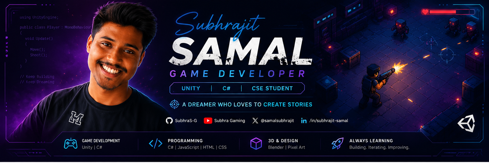

<!-- ========================= BANNER ========================= -->

  

<!-- ========================= INTRO ========================= -->
<h1 align="center">Hi 👋, I'm Subhrajit Samal</h1>
<h3 align="center">🎮 Aspiring Game Developer | Unity & C# Developer | Final Year CSE Student</h3>

  <i>"A Dreamer Who Loves to Create Stories."</i>

<!-- ========================= SOCIAL LINKS ========================= -->

  <a href="https://github.com/SubhraS-G">GitHub</a> •
  <a href="https://www.linkedin.com/in/subhrajit-samal-53136b294">LinkedIn</a> •
  <a href="https://www.youtube.com/@SubhraGaming69">YouTube</a> •
  <a href="https://x.com/samalsubhrajt1">X</a>

---

## 🚀 About Me

- 🎓 Final Year Computer Science Engineering Student
- 🎮 Passionate about Game Development and Interactive Storytelling
- 🛠️ Building games with Unity, C#, JavaScript, and HTML5 Canvas
- 🌱 Currently learning Advanced Unity Systems and Shader Graph
- 📹 Documenting my journey on YouTube
- 💡 Goal: Become a Professional Game Developer

---

## 🧰 Tech Stack

### Languages

### Tools & Engines

---

## 🎮 Featured Projects

### 🔫 [Top-Down Shooter](https://github.com/SubhraS-G/Top-Down-Shooter)
A cyberpunk top-down shooter built from scratch in Unity 6 with C#.

### 🏃 [Glitch Runner](https://github.com/SubhraS-G/Glitch-Runner)
A cyberpunk endless runner built with vanilla JavaScript and HTML5 Canvas.

### 🎮 [SKILL-ISSUE](https://github.com/SubhraS-G/SKILL-ISSUE)
A troll platformer inspired by rage games.

---

## 📊 GitHub Stats

  
  

  

---

## 🌱 Currently Learning

- Advanced Unity Architecture
- Shader Graph
- Game Optimization
- Multiplayer Networking

---

## 🏆 Goals for 2026

- Build 10 polished game projects
- Secure a Game Development Internship
- Publish games on itch.io
- Grow a strong technical portfolio

---

## 📫 Connect With Me

- 📧 Email: profession.subhra@gmail.com
- 💼 LinkedIn: https://www.linkedin.com/in/subhrajit-samal-53136b294
- 📺 YouTube: https://www.youtube.com/@SubhraGaming69
- 🐦 X: https://x.com/samalsubhrajt1

---

## 🐍 Contribution Snake

  

---

  ⭐ Thanks for visiting my profile!

